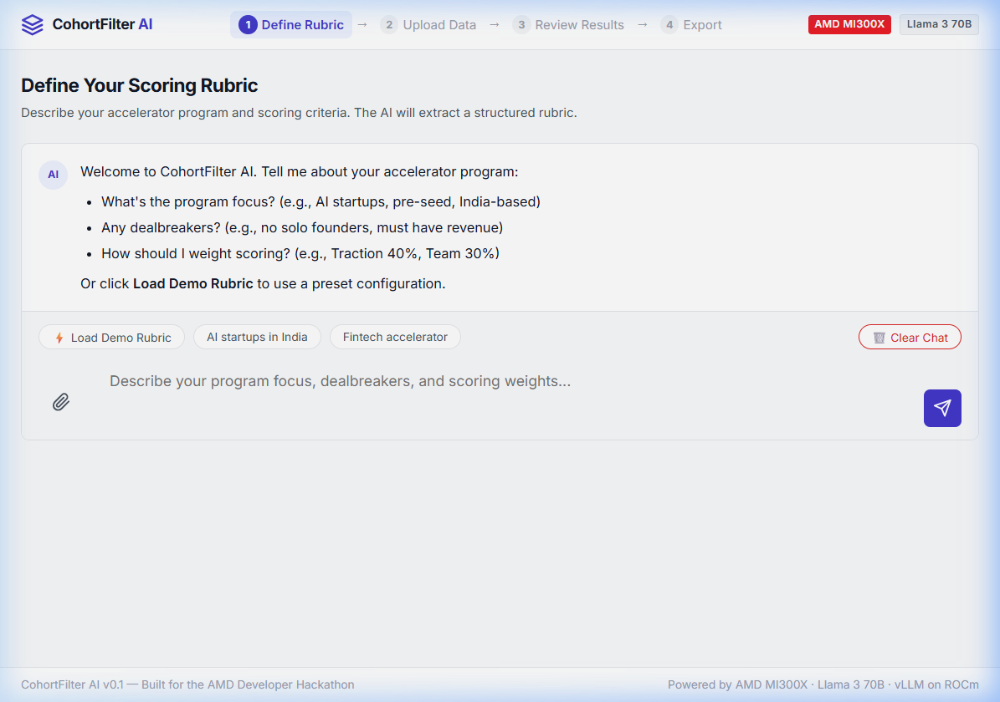

# CohortFilter AI
An AI-powered triage dashboard for startup accelerators to automatically score, rank, and filter large batches of applications based on custom rubrics and dealbreakers.



> The AI that shortlists accelerator applications so program managers only review the top 10%.

Built for the **AMD Developer Hackathon** (Online Phase) on LabLab.ai.

---

## Problem

Startup accelerators (Techstars, 500 Global, Google for Startups, NSRCEL, T-Hub) receive **1,000–30,000 applications per cohort**. Program managers spend **80% of their triage time** manually reading, scoring, and shortlisting — using spreadsheets, gut feel, and inconsistent rubrics.

No integrated AI scoring tool exists for this workflow.

## Solution

CohortFilter AI takes a **raw CSV** of startup applications and returns a **ranked shortlist** with explainable, rubric-aligned scores — in minutes, not weeks.

- **Chat-based rubric definition** — describe your program focus, dealbreakers, and scoring weights in natural language
- **Batch AI scoring** — each application scored 0–1000 across configurable dimensions
- **Duplicate/copycat detection** — heuristic text similarity flags overlapping ideas
- **Exportable deliverables** — branded PDF shortlist + scored CSV for stakeholder review

## How It Works

```
┌─────────────────────────────────────────────────────────────┐
│                    CohortFilter AI                          │
│                                                             │
│  ┌──────────┐    ┌──────────┐    ┌──────────┐              │
│  │  STEP 1  │───▶│  STEP 2  │───▶│  STEP 3  │              │
│  │  Define  │    │  Upload  │    │  Review   │              │
│  │  Rubric  │    │   CSV    │    │  Results  │              │
│  └──────────┘    └──────────┘    └──────────┘              │
│       │                │               │                    │
│   Chat with AI    Raw CSV from     Ranked dashboard         │
│   to set focus,   Typeform/Forms   + PDF shortlist          │
│   weights, and    (1,000+ rows)    + scored CSV export      │
│   dealbreakers                                              │
└─────────────────────────────────────────────────────────────┘
```

## Tech Stack

| Layer | Technology | Why |
|---|---|---|
| **LLM** | Llama 3 70B (or 8B for dev) | Open-source, strong reasoning |
| **Inference** | **vLLM on AMD MI300X** via ROCm | High-throughput batch inference on AMD GPU |
| **Backend** | Python / FastAPI | Async job-based scoring pipeline |
| **Frontend** | Vanilla HTML/CSS/JS | Zero-framework, fast, portable |
| **Data** | JSON/SQLite + MindsDB | Rubric persistence, scored results cache |
| **PDF Export** | ReportLab (server-side) | Clean, branded A4 shortlist reports |
| **Duplicate Detection** | difflib text similarity | Zero-dependency heuristic matching |

### AMD Developer Cloud Usage

CohortFilter AI runs inference on **AMD Instinct MI300X GPUs** via the AMD Developer Cloud, using **$100 in free hackathon credits** provided through the AMD AI Developer Program.

**Setup (hackathon participants):**
1. Sign up at [devcloud.amd.com](https://devcloud.amd.com) via the AMD AI Developer Program
2. Provision a **1x MI300X Small** instance with the **vLLM Quick Start** image (vLLM 0.8.6 + ROCm 6.4.0)
3. The vLLM server is pre-configured. SSH in and serve a model:

```bash
# vLLM is pre-installed in the Quick Start image
vllm serve meta-llama/Llama-3-8b-instruct \
  --host 0.0.0.0 --port 8000 \
  --dtype float16 --max-model-len 4096
```

4. Update `.env` with the instance IP:
```
LLM_MODE=vllm
LLM_BASE_URL=http://<instance-ip>:8000/v1
LLM_MODEL=meta-llama/Llama-3-8b-instruct
```

> **Cost:** ~$1.99/hr. The $100 credit covers ~50 hours — more than enough for development and demo.

## Setup & Run

### Prerequisites
- Python 3.10+
- pip

### Quick Start

```bash
# Clone
git clone https://github.com/<your-username>/cohortfilter-ai.git
cd cohortfilter-ai

# Install dependencies
cd backend
pip install -r requirements.txt

# Configure (optional — defaults to mock mode)
cp ../.env.example ../.env
# Edit .env to set LLM_MODE, LLM_BASE_URL, etc.

# Run
python -m uvicorn main:app --host 0.0.0.0 --port 8000 --reload
```

Open **http://localhost:8000** in your browser.

### Environment Variables

| Variable | Default | Description |
|---|---|---|
| `LLM_MODE` | `mock` | `mock`, `openai`, or `vllm` |
| `LLM_BASE_URL` | `http://localhost:8000/v1` | API endpoint for openai/vllm |
| `LLM_MODEL` | `meta-llama/Llama-3-70b-instruct` | Model identifier |
| `LLM_API_KEY` | `EMPTY` | API key (if required) |

## Demo

The app ships with a **50-row synthetic dataset** of Indian startup applications for live demo purposes. Click "Load Demo Rubric" and "Use Demo Dataset" to run the full scoring pipeline immediately.

### Demo Scenarios

1. **Happy Path** — AI-focused pre-seed startups scored and ranked. Top 10 shortlisted.
2. **Dealbreaker** — Solo founders and sub-$5K MRR auto-rejected with explanations.
3. **Duplicate Detection** — NeuralMesh AI ↔ SupplySync AI flagged at 82% similarity.

---

## License

MIT

## Team

Built by Jaideep Murthy for the AMD Developer Hackathon 2026.
